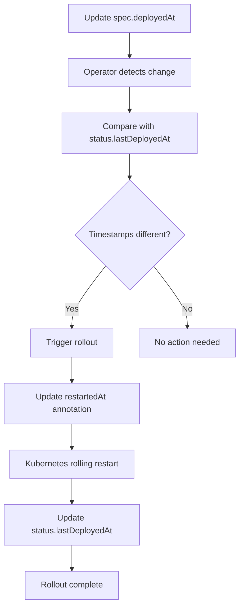

# Deployment Rollouts

The PiShop Operator supports triggering rollouts of all deployments by updating the `deployedAt` timestamp in the PRStack spec. This feature is useful for forcing pod restarts, applying configuration changes, or troubleshooting issues.

## How Rollouts Work

### Rollout Mechanism

1. **Set `spec.deployedAt`**: Update the `deployedAt` field with a current timestamp
2. **Controller Detection**: The operator compares `spec.deployedAt` with `status.lastDeployedAt`
3. **Rollout Triggered**: If different, all deployments in the namespace are rolled out
4. **Status Updated**: The `status.lastDeployedAt` is updated to match `spec.deployedAt`

The rollout is performed by updating the `kubectl.kubernetes.io/restartedAt` annotation on each deployment's pod template, which triggers Kubernetes to perform a rolling restart.

### Rollout Process



## Usage Examples

### Basic Rollout

Trigger a rollout for PR #123:

```bash
# Get current timestamp in RFC3339 format
TIMESTAMP=$(date -u +"%Y-%m-%dT%H:%M:%SZ")

# Update the PRStack to trigger rollout
kubectl patch prstack pr-123 --type=merge -p "{\"spec\":{\"deployedAt\":\"$TIMESTAMP\"}}"
```

### Using kubectl edit

```bash
kubectl edit prstack pr-123
```

Add or update the `deployedAt` field:

```yaml
spec:
  active: true
  deployedAt: "2025-01-15T14:30:00Z"  # Update this timestamp
  environment: pr-123
  imageTag: pr-123
  prNumber: "123"
  # ... rest of spec
```

### Using a YAML Patch File

```bash
# Create patch file
cat <<EOF > rollout-patch.yaml
spec:
  deployedAt: "$(date -u +"%Y-%m-%dT%H:%M:%SZ")"
EOF

# Apply the patch
kubectl patch prstack pr-123 --patch-file rollout-patch.yaml
```

### Programmatic Rollout (GitHub Actions)

```yaml
- name: Trigger Deployment Rollout
  run: |
    TIMESTAMP=$(date -u +"%Y-%m-%dT%H:%M:%SZ")
    kubectl patch prstack pr-${{ env.PR_NUMBER }} \
      --type=merge \
      -p "{\"spec\":{\"deployedAt\":\"$TIMESTAMP\"}}"
    
    echo "Rollout triggered at $TIMESTAMP"
```

### Combined Image Update and Rollout

Update both image tag and trigger rollout in one command:

```bash
TIMESTAMP=$(date -u +"%Y-%m-%dT%H:%M:%SZ")
kubectl patch prstack pr-123 --type=merge -p "{
  \"spec\": {
    \"imageTag\": \"pr-123-abc123\",
    \"deployedAt\": \"$TIMESTAMP\"
  }
}"
```

## Verification and Monitoring

### Check Rollout Status

```bash
# View deployment status
kubectl get deployments -n pr-123-shop-pilab-hu -o wide

# Check the restartedAt annotation
kubectl get deployment -n pr-123-shop-pilab-hu product-service \
  -o jsonpath='{.spec.template.metadata.annotations.kubectl\.kubernetes\.io/restartedAt}'

# View PRStack status
kubectl get prstack pr-123 -o yaml | grep -A 2 deployedAt
```

### Monitor Rollout Progress

```bash
# Watch all deployments
watch kubectl get deployments -n pr-123-shop-pilab-hu

# Watch pods during rollout
kubectl get pods -n pr-123-shop-pilab-hu -w

# Check rollout status for specific deployment
kubectl rollout status deployment/product-service -n pr-123-shop-pilab-hu
```

### View Operator Events

```bash
# Check events related to the PRStack
kubectl describe prstack pr-123 | grep -A 10 Events

# View operator logs
kubectl logs -n pishop-operator-system -l control-plane=controller-manager -f
```

## Expected Events and Status

### Successful Rollout Events

When a rollout is triggered successfully, you should see:

```
Normal  RolloutTriggered  PR #123 deployments rolled out successfully
```

### Failed Rollout Events

If there's an issue with the rollout:

```
Warning RolloutFailed  Failed to rollout deployments: <error details>
```

### Status Fields

The PRStack status includes rollout-related information:

```yaml
status:
  phase: "Running"
  message: "All services deployed successfully"
  lastDeployedAt: "2025-01-15T14:30:00Z"  # Timestamp of last rollout
  # ... other status fields
```

## Integration Patterns

### CI/CD Integration

#### GitHub Actions Workflow

```yaml
name: Deploy PR Environment
on:
  pull_request:
    types: [opened, synchronize, reopened]

jobs:
  deploy:
    runs-on: ubuntu-latest
    steps:
    - name: Checkout code
      uses: actions/checkout@v4
    
    - name: Set up kubectl
      uses: azure/setup-kubectl@v3
      with:
        version: 'v1.29.0'
    
    - name: Configure kubectl
      run: |
        echo "${{ secrets.KUBE_CONFIG }}" | base64 -d > ~/.kube/config
    
    - name: Deploy PR Stack
      run: |
        # Create or update PRStack
        kubectl apply -f - <<EOF
        apiVersion: shop.pilab.hu/v1alpha1
        kind: PRStack
        metadata:
          name: pr-${{ github.event.number }}
        spec:
          prNumber: "${{ github.event.number }}"
          imageTag: "pr-${{ github.event.number }}-${{ github.sha }}"
          active: true
          services:
            - product-service
            - cart-service
            - order-service
            - payment-service
        EOF
    
    - name: Trigger Rollout
      run: |
        TIMESTAMP=$(date -u +"%Y-%m-%dT%H:%M:%SZ")
        kubectl patch prstack pr-${{ github.event.number }} \
          --type=merge \
          -p "{\"spec\":{\"deployedAt\":\"$TIMESTAMP\"}}"
```

#### GitLab CI Pipeline

```yaml
stages:
  - deploy
  - rollout

deploy_pr_stack:
  stage: deploy
  script:
    - kubectl apply -f - <<EOF
      apiVersion: shop.pilab.hu/v1alpha1
      kind: PRStack
      metadata:
        name: pr-$CI_MERGE_REQUEST_IID
      spec:
        prNumber: "$CI_MERGE_REQUEST_IID"
        imageTag: "pr-$CI_MERGE_REQUEST_IID-$CI_COMMIT_SHORT_SHA"
        active: true
        services:
          - product-service
          - cart-service
          - order-service
          - payment-service
      EOF

trigger_rollout:
  stage: rollout
  script:
    - TIMESTAMP=$(date -u +"%Y-%m-%dT%H:%M:%SZ")
    - kubectl patch prstack pr-$CI_MERGE_REQUEST_IID \
        --type=merge \
        -p "{\"spec\":{\"deployedAt\":\"$TIMESTAMP\"}}"
```

### Configuration Management

#### ConfigMap Updates

```bash
# Update ConfigMap
kubectl patch configmap app-config -n pr-123-shop-pilab-hu \
  --patch '{"data":{"new-setting":"new-value"}}'

# Trigger rollout to pick up new config
TIMESTAMP=$(date -u +"%Y-%m-%dT%H:%M:%SZ")
kubectl patch prstack pr-123 --type=merge \
  -p "{\"spec\":{\"deployedAt\":\"$TIMESTAMP\"}}"
```

#### Secret Updates

```bash
# Update secret
kubectl patch secret app-secrets -n pr-123-shop-pilab-hu \
  --patch '{"data":{"new-secret":"'$(echo -n "secret-value" | base64)'"}}'

# Trigger rollout to pick up new secret
TIMESTAMP=$(date -u +"%Y-%m-%dT%H:%M:%SZ")
kubectl patch prstack pr-123 --type=merge \
  -p "{\"spec\":{\"deployedAt\":\"$TIMESTAMP\"}}"
```

## Troubleshooting

### Rollout Not Triggering

```bash
# Check if deployedAt is set
kubectl get prstack pr-123 -o jsonpath='{.spec.deployedAt}'

# Check if it matches lastDeployedAt
kubectl get prstack pr-123 -o jsonpath='{.status.lastDeployedAt}'

# If they match, update deployedAt to a new timestamp
kubectl patch prstack pr-123 --type=merge \
  -p "{\"spec\":{\"deployedAt\":\"$(date -u +"%Y-%m-%dT%H:%M:%SZ")\"}}"
```

### Deployments Not Restarting

```bash
# Check deployment annotations
kubectl get deployment -n pr-123-shop-pilab-hu -o yaml | grep -A 5 annotations

# Manually check deployment rollout status
kubectl rollout restart deployment/product-service -n pr-123-shop-pilab-hu

# Check if deployments are in the correct namespace
kubectl get deployments -n pr-123-shop-pilab-hu
```

### Operator Not Responding

```bash
# Check operator logs
kubectl logs -n pishop-operator-system -l control-plane=controller-manager --tail=100

# Restart operator
kubectl rollout restart deployment/pishop-operator-controller-manager -n pishop-operator-system

# Check operator health
kubectl get pods -n pishop-operator-system
```

### Partial Rollout Failures

```bash
# Check which deployments failed to restart
kubectl get deployments -n pr-123-shop-pilab-hu -o wide

# Check specific deployment status
kubectl describe deployment product-service -n pr-123-shop-pilab-hu

# Check pod events
kubectl get events -n pr-123-shop-pilab-hu --sort-by='.lastTimestamp'
```

## Best Practices

### Timestamp Format

Always use RFC3339 format for timestamps:

```bash
# Correct format
TIMESTAMP=$(date -u +"%Y-%m-%dT%H:%M:%SZ")
# Example: 2025-01-15T14:30:00Z

# Avoid these formats
TIMESTAMP=$(date)  # Wrong: includes timezone info
TIMESTAMP=$(date +%s)  # Wrong: Unix timestamp
```

### Rollout Timing

1. **Wait for previous rollout to complete** before triggering another
2. **Monitor rollout progress** to ensure all pods are healthy
3. **Use with image tag updates** to ensure pods pull latest images
4. **Set `imagePullPolicy: Always`** in deployments for reliable updates

### Resource Management

```bash
# Check resource usage before rollout
kubectl top pods -n pr-123-shop-pilab-hu

# Monitor resource usage during rollout
watch kubectl top pods -n pr-123-shop-pilab-hu
```

### Rollback Strategy

If a rollout causes issues:

```bash
# Check previous deployment revision
kubectl rollout history deployment/product-service -n pr-123-shop-pilab-hu

# Rollback to previous version
kubectl rollout undo deployment/product-service -n pr-123-shop-pilab-hu

# Or rollback to specific revision
kubectl rollout undo deployment/product-service --to-revision=2 -n pr-123-shop-pilab-hu
```

## Limitations

- Only triggers rollout for existing deployments in the namespace
- Doesn't create new deployments or update image tags (use separate spec fields)
- Stack must be in `active: true` state for rollout to work
- Rollout happens asynchronously; check deployment status to confirm completion
- Requires operator to be running and healthy

## Integration with Other Features

### Backup Integration

```bash
# Create backup before rollout
kubectl patch prstack pr-123 --type=merge -p '{
  "spec": {
    "backupConfig": {
      "enabled": true,
      "schedule": "manual-backup-'$(date +%s)'"
    }
  }
}'

# Wait for backup completion, then trigger rollout
TIMESTAMP=$(date -u +"%Y-%m-%dT%H:%M:%SZ")
kubectl patch prstack pr-123 --type=merge \
  -p "{\"spec\":{\"deployedAt\":\"$TIMESTAMP\"}}"
```

### Monitoring Integration

```bash
# Set up monitoring before rollout
kubectl patch prstack pr-123 --type=merge -p '{
  "spec": {
    "monitoring": {
      "enabled": true,
      "alerts": ["rollout-completion", "health-check"]
    }
  }
}'

# Trigger rollout with monitoring
TIMESTAMP=$(date -u +"%Y-%m-%dT%H:%M:%SZ")
kubectl patch prstack pr-123 --type=merge \
  -p "{\"spec\":{\"deployedAt\":\"$TIMESTAMP\"}}"
```

## Next Steps

After mastering deployment rollouts:

1. [Learn about backup and restore](Backup-Restore)
2. [Set up monitoring and alerting](Monitoring-Observability)
3. [Implement advanced deployment strategies](Advanced-Features)
4. [Configure CI/CD pipelines](CI-CD-Integration)
