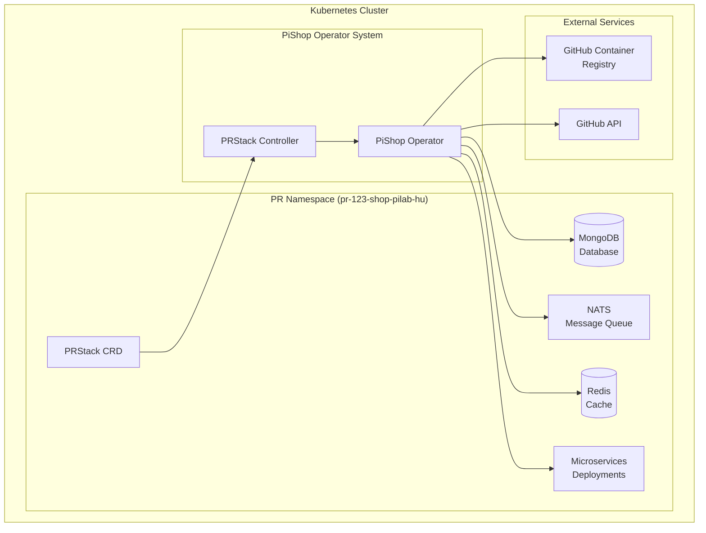

# PiShop Operator Wiki

Welcome to the PiShop Operator documentation! This wiki provides comprehensive guides for deploying, configuring, and managing PR-based environments for PiShop microservices.

## 🚀 What is PiShop Operator?

The PiShop Operator is a sophisticated Kubernetes operator built with Go and controller-runtime that automates the creation and management of isolated environments for each pull request. It provides:

- **Automated PR Environment Provisioning**: Spin up complete isolated environments for each pull request
- **Database Management**: Automated MongoDB database and user creation per PR
- **Message Queue Isolation**: NATS subject management for complete PR isolation
- **Cache Isolation**: Redis keyspace isolation for each PR environment
- **Service Orchestration**: Automated deployment and management of microservices
- **Resource Management**: Configurable CPU, memory, and storage limits
- **Backup & Restore**: Automated backup scheduling and restore capabilities

## 📚 Documentation Pages

### Getting Started
- [Installation Guide](Installation) - Step-by-step installation instructions
- [Quick Start](Quick-Start) - Get up and running in minutes
- [Configuration](Configuration) - Complete configuration reference

### Usage & Management
- [Creating PR Stacks](Creating-PR-Stacks) - How to create and manage PR environments
- [Deployment Rollouts](Deployment-Rollouts) - Triggering service rollouts
- [Backup & Restore](Backup-Restore) - Managing backups and restores
- [Multi-Tenant Deployment](Multi-Tenant-Deployment) - Production tenant management

### Advanced Topics
- [Custom Domains](Custom-Domains) - Setting up custom domains and TLS
- [Resource Management](Resource-Management) - CPU, memory, and storage configuration
- [Monitoring & Observability](Monitoring-Observability) - Health checks and monitoring
- [Security](Security) - Security best practices and RBAC

### Troubleshooting
- [Common Issues](Common-Issues) - Solutions to frequent problems
- [Debugging](Debugging) - Debug techniques and log analysis
- [Performance Tuning](Performance-Tuning) - Optimizing operator performance

### Development
- [Architecture](Architecture) - Understanding the operator architecture
- [Contributing](Contributing) - How to contribute to the project
- [API Reference](API-Reference) - Complete PRStack CRD documentation

## 🏗️ Architecture Overview



## 🎯 Key Features

### Core Capabilities
- **PR-Based Isolation**: Each PR gets its own namespace, database, and message queue
- **GitHub Integration**: Seamless integration with GitHub Container Registry
- **Automatic Cleanup**: Intelligent expiration and cleanup of PR environments
- **Health Monitoring**: Comprehensive status tracking and health checks
- **Rolling Updates**: Zero-downtime deployments with configurable strategies

### Advanced Features
- **Custom Domains**: Support for custom domains with TLS certificates
- **Multi-Tenant**: Production tenant support with dedicated domains
- **Backup Automation**: Scheduled backups with retention policies
- **Resource Scaling**: Configurable resource limits and auto-scaling
- **Service Mesh Ready**: Compatible with Istio and other service mesh solutions

## 🚀 Quick Example

Create a PR environment for PR #123:

```yaml
apiVersion: shop.pilab.hu/v1alpha1
kind: PRStack
metadata:
  name: pr-123
spec:
  prNumber: "123"
  active: true
  services:
    - product-service
    - cart-service
    - order-service
    - payment-service
```

The operator will automatically:
1. Create namespace `pr-123-shop-pilab-hu`
2. Provision MongoDB database and user
3. Set up NATS subject isolation
4. Configure Redis keyspace isolation
5. Deploy all specified microservices
6. Create ingress with domain `pr-123.shop.pilab.hu`

## 📞 Support & Community

- **GitHub Issues**: [Report bugs and request features](https://github.com/pilab-dev/pishop-operator/issues)
- **Discussions**: [Community discussions](https://github.com/pilab-dev/pishop-operator/discussions)
- **Email**: support@pilab.hu
- **Discord**: [PiLab Community](https://discord.gg/pilab)

## 📄 License

This project is licensed under the MIT License - see the [LICENSE](https://github.com/pilab-dev/pishop-operator/blob/main/LICENSE) file for details.

---

<div align="center">
  <strong>Built with ❤️ by the PiLab Team</strong>
</div>
